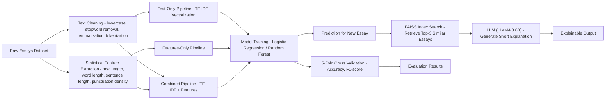

# RAG-Enhanced-Authorship-Classification-for-Essays

## 📌 Overview
This project focuses on classifying essays as **Human-written** or **AI-generated** using a dataset of **500k essays**.  
The pipeline combines **traditional machine learning models** with **statistical features**, **text embeddings**, and a **RAG-style explainability component**.

---

## 🔍 Methodology

### 1️⃣ Data Preprocessing
- **Text Cleaning**:
  - Lowercasing
  - Stopword removal
  - Lemmatization
  - Tokenization
- **Statistical Feature Engineering**:
  - Message length
  - Average word length
  - Average sentence length
  - Sentence count
  - Punctuation density

### 2️⃣ Exploratory Data Analysis (EDA)
- Distribution plots for statistical features
- Standard deviation analysis for variability
- Comparison between **AI-generated** and **Human-written** text

### 3️⃣ Model Training
Models used:
- **Logistic Regression**
- **Random Forest Classifier**

Three experiments:
1. **Only Text** → TF-IDF vectorization
2. **Only Features** → Statistical features only
3. **Text + Features** → Combined feature set

Evaluation:
- **5-Fold Cross Validation**
- Accuracy, Precision, Recall, F1-score

### 4️⃣ Explainability with RAG
- **Embeddings**: Generated for all essays
- **Indexing**: FAISS index for fast similarity search
- **Retrieval**: Top 3 similar essays for a given input
- **LLM Explanation**:
  - Prompt includes the new essay + retrieved essays
  - Short, human-readable explanation of classification
  - Powered by **LLaMA 3 8B** model

---

| Experiment      | Model               | Accuracy | F1 Score |
| --------------- | ------------------- | -------- | -------- |
| Text Only       | Logistic Regression | 98%      | 98%      |
| Features Only   | Logistic Regression | 80%      | 78%      |
| Text + Features | Logistic Regression | 98%      | 98%      |
| Text Only       | Random Forest       | 99%      | 99%      |
| Features Only   | Random Forest       | 97%      | 97%      |
| Text + Features | Random Forest       | 99%      | 99%      |  

---

## 🖇️ Project Pipeline

---

💡 **Key Insights**
- Combining **text** and **statistical features** outperforms single input methods.
- RAG-based explanations improve interpretability and trust in predictions.
- Logistic Regression performs strongly on TF-IDF text representations.
- Random Forest excels on statistical features alone.

---

📈 **Future Improvements**
- Experiment with **deep learning models** (LSTM, BERT).
- Improve feature engineering with syntactic and semantic features.
- Enhance RAG explanations with more advanced LLM prompting strategies.
- Add **real-time API** for deployment.
  
---

🛠 **Tech Stack****
- **Python**
- **Scikit-learn**
- **FAISS**
- **NLTK**
- **Matplotlib & Seaborn**
- **LLaMA 3 8B** for explanations

---

🙌 Acknowledgements
- Dataset sourced from [Kaggle](https://www.kaggle.com/datasets/shanegerami/ai-vs-human-text)
- LLaMA 3 8B for LLM-based explanations
- FAISS for efficient similarity search

